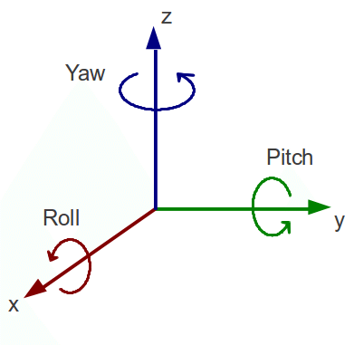

# obj-cesium-viewer
view obj model correctly in cesium

# functions
- upload [obj](https://en.wikipedia.org/wiki/Wavefront_.obj_file) model to the server
- convert uploaded model to [gltf](https://github.com/KhronosGroup/glTF) format
- load the gltf model in [cesium](https://cesiumjs.org/) with params
  * position（longitude, latitude, height or altitude)
  * scale
  * rotate model around X,Y,Z axis by adjusting models' heading(yaw), pitch, roll
  