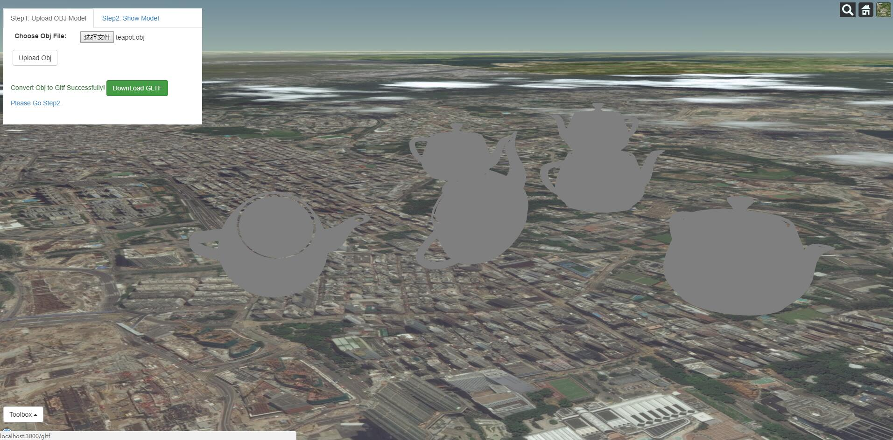
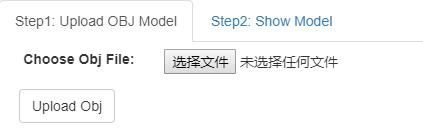
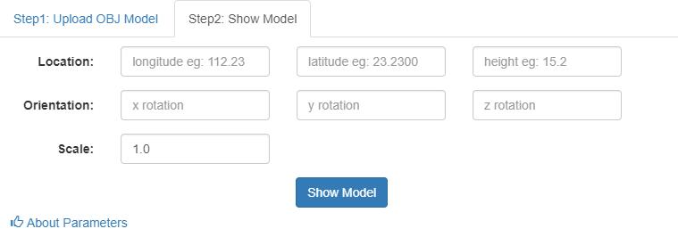

# obj-cesium-viewer
view obj model correctly in cesium

# Requirements
node 8.0 plus
git

# Install
1.install the repo
```
$ git clone https://github.com/YinChaoOnline/obj-cesium-viewer
```

2.change to obj-cesium-viewer folder, install node packages
```
$ cd obj-cesium-viewer
$ npm i
```

3.start the server
```
$ node server
```

4.play with the repo;upload a obj, and visulize the model in different locations and orientation and scales.

# functions
- upload [obj](https://en.wikipedia.org/wiki/Wavefront_.obj_file) model to the server
- convert uploaded model to [gltf](https://github.com/KhronosGroup/glTF) format
- load the gltf model in [cesium](https://cesiumjs.org/) with params
  * position（longitude, latitude, height or altitude)
  * scale
  * rotate model around X,Y,Z axis by adjusting models' heading(yaw), pitch, roll
  

# project snapshots
1.project ui



2.tab1



3.tab2


